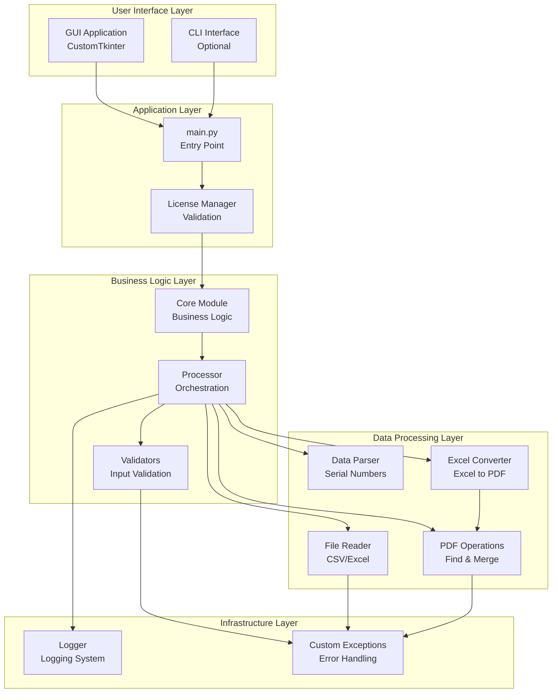
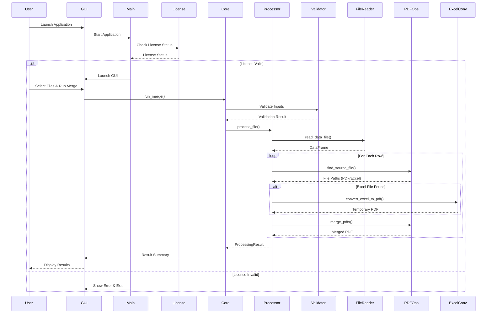
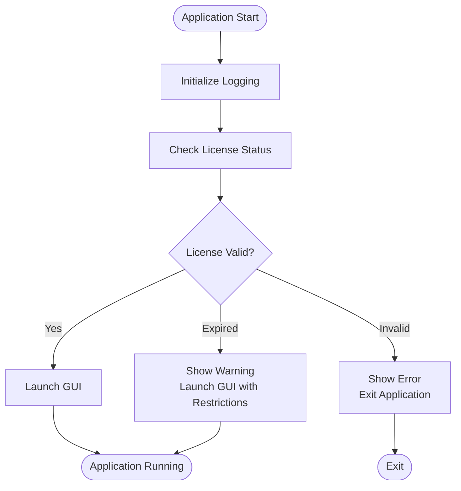
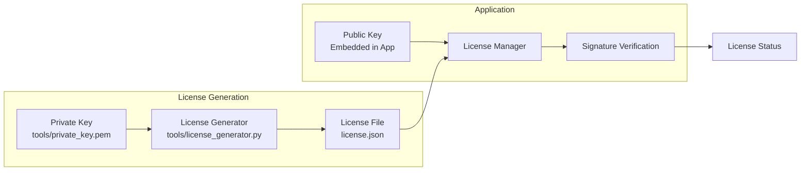
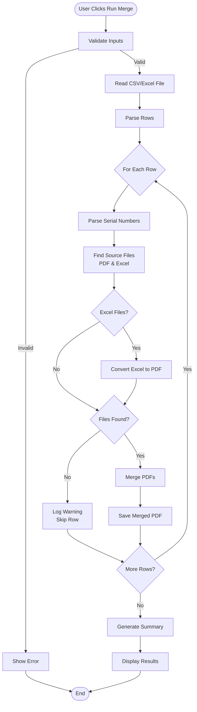
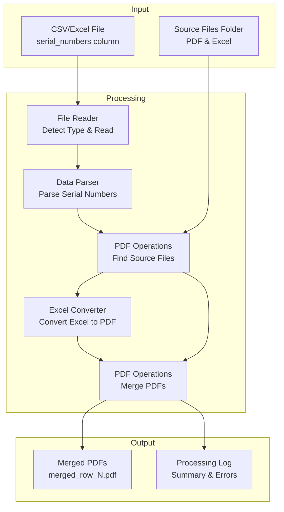

# PDF Batch Merger - Architecture Documentation

## Table of Contents

1. [Overview](#overview)
2. [System Architecture](#system-architecture)
3. [Component Structure](#component-structure)
4. [Data Flow](#data-flow)
5. [Architecture Principles](#architecture-principles)

---

## Overview

PDF Batch Merger is a desktop application built with Python that merges multiple PDF and Excel files into PDF documents based on instructions from CSV or Excel files. The application follows a modular architecture with clear separation of concerns between business logic, user interface, and data processing.

### Key Features

- **GUI Application**: Built with CustomTkinter for a modern, cross-platform interface
- **License Management**: RSA-signed license validation system
- **Modular Design**: Clean separation between core logic, UI, and utilities
- **Comprehensive Testing**: Full test coverage with pytest
- **Multiple Input Formats**: Supports CSV and Excel files
- **Mixed File Support**: Can merge PDF and Excel files together (Excel files are converted to PDF)
- **Flexible File Matching**: Case-insensitive filename matching for PDF and Excel files

---

## System Architecture

### High-Level Architecture



### Component Interaction Flow



---

## Component Structure

### Directory Structure

```
files_unifeder/
├── main.py                      # Application entry point
├── pdf_merger/                   # Main package
│   ├── __init__.py              # Public API exports
│   ├── config.py                # Configuration settings
│   ├── logger.py                # Logging configuration
│   ├── exceptions.py            # Custom exception classes
│   │
│   ├── core/                    # Business logic layer
│   │   ├── merger.py           # Core merge orchestration
│   │   └── reporter.py         # Result formatting
│   │
│   ├── processor.py            # Main processing orchestration
│   ├── validators.py            # Input validation functions
│   ├── data_parser.py           # Serial number parsing
│   ├── file_reader.py           # CSV/Excel file reading
│   ├── pdf_operations.py        # PDF finding and merging
│   ├── excel_converter.py       # Excel to PDF conversion
│   │
│   ├── ui/                      # User interface
│   │   ├── app.py              # CustomTkinter GUI application
│   │   └── __init__.py
│   │
│   └── licensing/               # License management
│       ├── license_manager.py  # License validation
│       ├── license_model.py    # License data model
│       └── license_signer.py   # RSA signing/verification
│
├── cli/                         # Command-line interfaces (optional)
│   ├── command_line.py         # CLI with arguments
│   └── interactive.py          # Interactive prompts
│
├── tests/                       # Test suite
│   ├── test_*.py               # Unit tests for each module
│   └── README.md               # Testing documentation
│
├── tools/                       # Development tools
│   └── license_generator.py    # License generation tool
│
└── requirements.txt            # Python dependencies
```

### Core Components

#### 1. Entry Point (`main.py`)

- **Responsibility**: Application bootstrap and license checking
- **Flow**: 
  1. Initialize logging
  2. Check license status
  3. Launch GUI if license valid
  4. Handle license errors gracefully



#### 2. Core Module (`pdf_merger/core/`)

- **`merger.py`**: High-level merge orchestration
  - Coordinates validation, processing, and result formatting
  - Decouples UI from business logic
  
- **`reporter.py`**: Result formatting
  - Formats processing results for display
  - Generates summary and detailed reports

#### 3. Processor (`pdf_merger/processor.py`)

- **Responsibility**: Main processing orchestration
- **Key Functions**:
  - `process_file()`: Process entire CSV/Excel file
  - `process_row()`: Process single row
  - Returns `ProcessingResult` with statistics

#### 4. Validators (`pdf_merger/validators.py`)

- **Responsibility**: Input validation
- **Validates**:
  - File existence and format
  - Folder existence
  - Required columns in data files
  - Serial number format (GRNW_ prefix)
  - Complete path sets

#### 5. File Reader (`pdf_merger/file_reader.py`)

- **Responsibility**: Reading CSV and Excel files
- **Features**:
  - Auto-detects file type (.csv, .xlsx, .xls)
  - Auto-detects CSV delimiter (comma, semicolon, tab)
  - Unified interface for all file types
  - Returns pandas DataFrame

#### 6. Data Parser (`pdf_merger/data_parser.py`)

- **Responsibility**: Parsing serial numbers from strings
- **Features**:
  - Handles comma-separated values
  - Strips whitespace
  - Validates format

#### 7. PDF Operations (`pdf_merger/pdf_operations.py`)

- **Responsibility**: PDF file operations
- **Features**:
  - `find_source_file()`: Case-insensitive finding of PDF and Excel files
  - `find_pdf_file()`: Case-insensitive PDF finding (backward compatibility)
  - `merge_pdfs()`: Merging multiple PDFs into one
  - Lazy loading of PDF libraries (pypdf)

#### 7a. Excel Converter (`pdf_merger/excel_converter.py`)

- **Responsibility**: Converting Excel files to PDF format
- **Features**:
  - `convert_excel_to_pdf()`: Converts .xlsx and .xls files to PDF
  - Uses xlsx2pdf library for conversion
  - Lazy loading of conversion library

#### 8. UI Module (`pdf_merger/ui/app.py`)

- **Responsibility**: GUI application
- **Technology**: CustomTkinter
- **Features**:
  - File/folder selection dialogs
  - Real-time progress logging
  - Result display
  - License status indicator

#### 9. Licensing System (`pdf_merger/licensing/`)

- **`license_manager.py`**: License validation and status checking
- **`license_model.py`**: License data structure
- **`license_signer.py`**: RSA signature generation and verification



---

## Data Flow

### Processing Flow



### File Processing Pipeline



---

## Architecture Principles

1. **Separation of Concerns**: Clear boundaries between UI, business logic, and data processing
2. **Modularity**: Each module has a single, well-defined responsibility
3. **Testability**: Components are designed to be easily testable with mocks
4. **Extensibility**: New features can be added without modifying core logic
5. **Error Handling**: Comprehensive exception hierarchy for clear error messages
6. **Logging**: Structured logging throughout for debugging and monitoring

---

## Additional Resources

- **Installation Guide**: See `INSTALLATION.md`
- **Testing Guide**: See `TESTING.md`
- **User Guide**: See `docs/README_USER.md`
- **Build Guide**: See `BUILD.md` for packaging instructions
- **License Tools**: See `tools/README.md` for license generation

---

## Version

Current version: **1.0.0**
