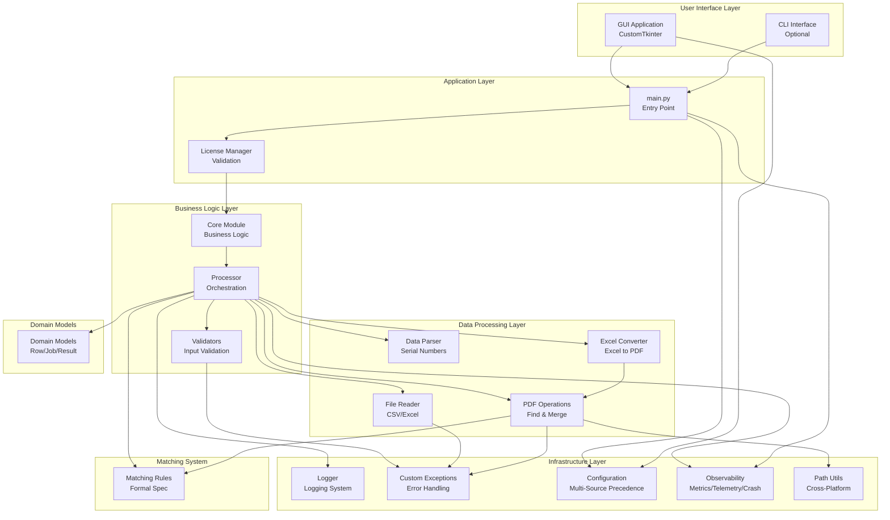
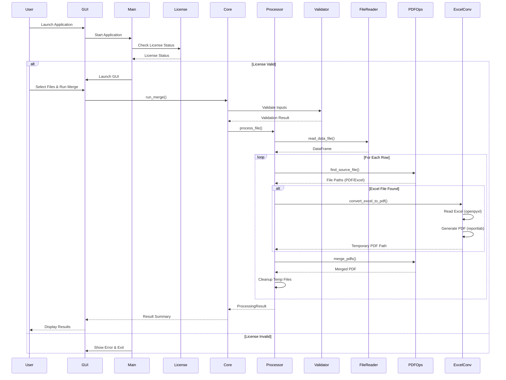
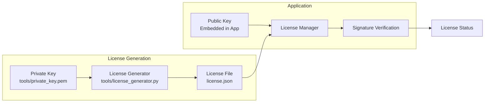
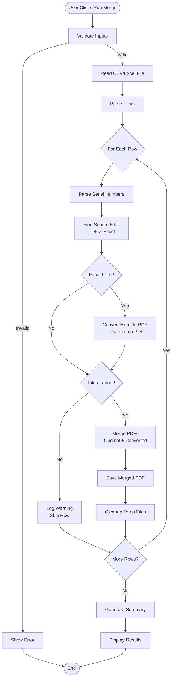
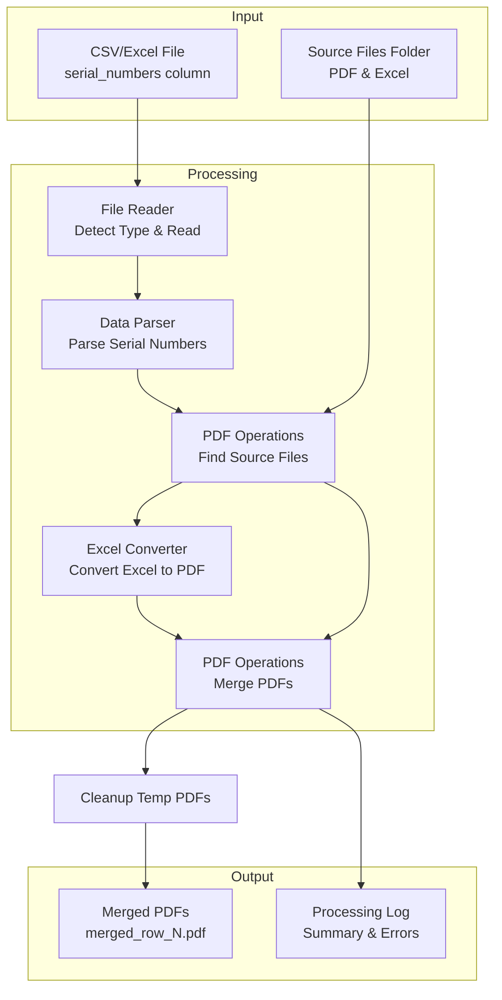

# PDF Batch Merger - Architecture Documentation

## Table of Contents

1. [Overview](#overview)
2. [System Architecture](#system-architecture)
3. [Component Structure](#component-structure)
4. [Data Flow](#data-flow)
5. [Architecture Principles](#architecture-principles)

---

## Overview

PDF Batch Merger is a desktop application built with Python that merges multiple PDF and Excel files into PDF documents based on instructions from CSV or Excel files. The application follows a modular architecture with clear separation of concerns between business logic, user interface, and data processing.

### Key Features

- **GUI Application**: Built with CustomTkinter for a modern, cross-platform interface
- **License Management**: RSA-signed license validation system with offline mode, clock skew tolerance, and expiry warnings
- **Modular Design**: Clean separation between core logic, UI, and utilities
- **Comprehensive Testing**: Full test coverage with pytest
- **Multiple Input Formats**: Supports CSV and Excel files
- **Mixed File Support**: Can merge PDF and Excel files together (Excel files are converted to PDF)
- **Formal Matching Rules**: Deterministic file matching with ambiguity detection and Unicode normalization
- **Configuration Management**: Multi-source configuration with precedence (env vars > CLI > config > presets > defaults)
- **Domain Models**: Explicit type-safe models for rows, jobs, and results
- **Cross-Platform Support**: Handles Windows/macOS path differences (case sensitivity, Unicode, long paths)
- **Memory Efficiency**: Streaming mode for large PDF merging
- **Excel Rendering**: Pagination support for wide tables with auto-sizing
- **Observability**: Opt-in metrics, telemetry, and crash reporting

---

## System Architecture

### High-Level Architecture



### Component Interaction Flow



---

## Component Structure

### Directory Structure

```
files_unifeder/
├── main.py                      # Application entry point
├── pdf_merger/                   # Main package
│   ├── __init__.py              # Public API exports
│   ├── config.py                # Configuration settings with precedence
│   ├── config_schema.py         # Configuration schema and validation
│   ├── logger.py                # Logging configuration
│   ├── exceptions.py            # Custom exception classes
│   │
│   ├── core/                    # Business logic layer
│   │   ├── merger.py           # Core merge orchestration
│   │   └── reporter.py         # Result formatting
│   │
│   ├── models/                  # Domain models
│   │   ├── row.py              # Row data model
│   │   ├── merge_job.py        # Merge job model
│   │   └── merge_result.py     # Merge result model
│   │
│   ├── matching/                # Matching rules
│   │   ├── rules.py            # Formal matching rules
│   │   └── spec.md             # Matching specification
│   │
│   ├── utils/                   # Utility modules
│   │   └── path_utils.py       # Cross-platform path handling
│   │
│   ├── observability/           # Observability features
│   │   ├── metrics.py          # Metrics collection
│   │   ├── telemetry.py        # Telemetry (opt-in)
│   │   └── crash_reporting.py  # Crash reporting (opt-in)
│   │
│   ├── processor.py            # Main processing orchestration
│   ├── validators.py            # Input validation functions
│   ├── data_parser.py           # Serial number parsing
│   ├── file_reader.py           # CSV/Excel file reading
│   ├── pdf_operations.py        # PDF finding and merging
│   ├── pdf_operations_streaming.py  # Streaming PDF operations
│   ├── excel_converter.py       # Excel to PDF conversion
│   │
│   ├── ui/                      # User interface
│   │   ├── app.py              # CustomTkinter GUI application
│   │   └── __init__.py
│   │
│   └── licensing/               # License management
│       ├── license_manager.py  # License validation with UX improvements
│       ├── license_model.py    # License data model with expiry warnings
│       └── license_signer.py   # RSA signing/verification
│
├── cli/                         # Command-line interfaces (optional)
│   ├── command_line.py         # CLI with arguments
│   └── interactive.py          # Interactive prompts
│
├── tests/                       # Test suite
│   ├── test_*.py               # Unit tests for each module
│   └── README.md               # Testing documentation
│
├── tools/                       # Development tools
│   └── license_generator.py    # License generation tool
│
└── requirements.txt            # Python dependencies
```

### Core Components

#### 1. Entry Point (`main.py`)

- **Responsibility**: Application bootstrap, observability initialization, and license checking
- **Flow**: 
  1. Initialize logging
  2. Load configuration
  3. Initialize observability (metrics, telemetry, crash reporting - opt-in)
  4. Check license status with expiry warnings
  5. Launch GUI if license valid
  6. Handle license errors gracefully with actionable messages


#### 2. Core Module (`pdf_merger/core/`)

- **`merger.py`**: High-level merge orchestration
  - Coordinates validation, processing, and result formatting
  - Decouples UI from business logic
  
- **`reporter.py`**: Result formatting
  - Formats processing results for display
  - Generates summary and detailed reports

#### 3. Processor (`pdf_merger/processor.py`)

- **Responsibility**: Main processing orchestration using domain models
- **Key Functions**:
  - `process_file()`: Process entire CSV/Excel file (legacy, backward compatible)
  - `process_job()`: Process MergeJob using domain models (recommended)
  - `process_row_with_models()`: Process single row using Row model
  - Returns `MergeResult` with detailed per-row results
- **Domain Model Integration**:
  - Uses `Row`, `MergeJob`, and `MergeResult` models for type safety
  - Tracks detailed results per row (files found, missing, processing time)
  - Supports ambiguous match detection with configurable behavior
- **Observability Integration**:
  - Records metrics (processing time, file sizes, success rates, ambiguous matches)
  - Tracks counters and timers for performance analysis
- **Excel Handling**:
  - Finds both PDF and Excel files using formal matching rules
  - Converts Excel files to temporary PDFs using `convert_excel_to_pdf()`
  - Merges all PDFs (original + converted Excel PDFs) with streaming support
  - Automatically cleans up temporary PDF files after merging
  - Handles conversion errors gracefully (logs and continues with other files)

#### 4. Validators (`pdf_merger/validators.py`)

- **Responsibility**: Input validation
- **Validates**:
  - File existence and format
  - Folder existence
  - Required columns in data files
  - Serial number format (GRNW_ prefix)
  - Complete path sets

#### 5. File Reader (`pdf_merger/file_reader.py`)

- **Responsibility**: Reading CSV and Excel files
- **Features**:
  - Auto-detects file type (.csv, .xlsx, .xls)
  - Auto-detects CSV delimiter (comma, semicolon, tab)
  - Unified interface for all file types
  - Returns pandas DataFrame

#### 6. Data Parser (`pdf_merger/data_parser.py`)

- **Responsibility**: Parsing serial numbers from strings
- **Features**:
  - Handles comma-separated values
  - Strips whitespace
  - Validates format

#### 7. PDF Operations (`pdf_merger/pdf_operations.py`)

- **Responsibility**: PDF file operations with streaming support
- **Features**:
  - `find_source_file()`: Uses formal matching rules with ambiguity detection
  - `find_pdf_file()`: Case-insensitive PDF finding (backward compatibility)
  - `merge_pdfs()`: Merging multiple PDFs with automatic streaming for large files
  - Lazy loading of PDF libraries (pypdf)
  - Suppresses noisy PDF read warnings (Apple-annotated PDFs)
- **Streaming Support**:
  - Auto-detects large files and uses streaming mode
  - Processes pages incrementally to conserve memory
  - Configurable threshold (default: 100 MB estimated memory usage)
- **Matching Integration**:
  - Uses formal matching rules from `matching/rules.py`
  - Supports configurable ambiguity handling (FAIL_FAST, WARN_FIRST, LOG_ALL)
  - Unicode normalization for cross-platform compatibility
- **Implementation Details**:
  - Uses `strict=False` mode for pypdf to handle problematic PDFs
  - Suppresses stderr during PDF reading to avoid noisy warnings
  - Handles PdfReadError exceptions gracefully
  - Supports both pypdf and PyPDF2 libraries (with pypdf preferred)
  - Cross-platform path handling via `utils/path_utils.py`

#### 7b. PDF Streaming Operations (`pdf_merger/pdf_operations_streaming.py`)

- **Responsibility**: Memory-efficient PDF merging for large files
- **Features**:
  - `merge_pdfs_streaming()`: Processes pages in chunks
  - `should_use_streaming()`: Auto-detects when streaming is needed
  - `estimate_memory_usage()`: Estimates memory requirements
- **Performance**:
  - Processes pages incrementally (default: 10 pages per chunk)
  - Reduces memory footprint for large PDFs
  - Progress logging for files with >100 pages

#### 7a. Excel Converter (`pdf_merger/excel_converter.py`)

- **Responsibility**: Converting Excel files to PDF format with advanced rendering
- **Features**:
  - `convert_excel_to_pdf()`: Converts .xlsx and .xls files to PDF
  - Uses openpyxl to read Excel files and reportlab to generate PDFs
  - Handles empty cells and None values gracefully
  - Creates formatted PDF tables from Excel data
  - Supports both .xlsx and .xls formats (note: openpyxl primarily supports .xlsx)
- **Advanced Features**:
  - **Pagination**: Automatically splits wide tables across multiple pages
  - **Auto-sizing**: Calculates optimal column widths based on content
  - **Configurable page size**: Supports letter, A4, and custom sizes
  - **Orientation support**: Portrait and landscape modes
  - **Improved fidelity**: Enhanced fonts, colors, borders, and alternating row colors
- **Dependencies**:
  - `openpyxl>=3.0.0` - Excel file reading
  - `reportlab>=3.6.0` - PDF generation
- **Implementation Details**:
  - Reads all rows from the active Excel sheet
  - Converts data to a formatted PDF table with headers
  - Handles styling (headers, borders, colors, alternating rows)
  - Preserves data structure in PDF format
  - Splits tables wider than 8 columns (configurable) across pages

#### 8. UI Module (`pdf_merger/ui/app.py`)

- **Responsibility**: GUI application with configuration integration
- **Technology**: CustomTkinter
- **Features**:
  - File/folder selection dialogs
  - Real-time progress logging
  - Result display
  - License status indicator with expiry warnings
  - Configuration loading (pre-populates fields from config)
  - Updated labels: "Source Directory" (supports PDF and Excel files)
- **License UX**:
  - Shows expiry warnings (critical/warning/info based on days remaining)
  - Displays days until expiry
  - Color-coded status (green/yellow/orange/red)
  - Offline mode detection
- **Configuration Integration**:
  - Loads configuration on startup
  - Pre-populates file/directory fields from config
  - Supports all configuration sources (env vars, config files, presets)
- **UI Updates**:
  - Changed "PDF Directory" to "Source Directory" to reflect Excel support
  - Updated dialog titles and validation messages
  - Shows Excel conversion progress in logs

#### 9. Licensing System (`pdf_merger/licensing/`)

- **`license_manager.py`**: License validation with enhanced UX
  - Offline mode detection
  - Clock skew tolerance (configurable, default ±5 minutes)
  - Expiry warning messages (30/14/7 days before expiry)
  - Actionable error messages
  - License refresh mechanism
- **`license_model.py`**: License data structure with expiry utilities
  - `days_until_expiry()`: Calculates days until license expires
  - `get_expiry_warning_level()`: Returns warning level (critical/warning/info)
  - `is_expired()`: Checks expiration with clock skew tolerance
- **`license_signer.py`**: RSA signature generation and verification



---

## Data Flow

### Processing Flow



### File Processing Pipeline



---

## Architecture Principles

1. **Separation of Concerns**: Clear boundaries between UI, business logic, and data processing
2. **Modularity**: Each module has a single, well-defined responsibility
3. **Testability**: Components are designed to be easily testable with mocks and domain models
4. **Extensibility**: New features can be added without modifying core logic (Excel support added without breaking existing PDF-only workflows)
5. **Error Handling**: Comprehensive exception hierarchy for clear error messages
6. **Logging**: Structured logging throughout for debugging and monitoring
7. **Backward Compatibility**: Existing functionality preserved when adding new features
8. **Resource Management**: Automatic cleanup of temporary files (Excel-to-PDF conversions)
9. **Type Safety**: Explicit domain models with type hints for better contracts
10. **Determinism**: Formal matching rules ensure consistent behavior across runs
11. **Cross-Platform**: Handles platform differences (case sensitivity, Unicode, long paths)
12. **Privacy-First**: All observability features are opt-in with anonymization

---

## Technical Details

### Excel to PDF Conversion

The Excel converter uses a two-step process:

1. **Reading**: Uses `openpyxl` to read Excel files (.xlsx format)
   - Reads all rows from the active sheet
   - Handles empty cells (converts None to empty strings)
   - Preserves data structure

2. **PDF Generation**: Uses `reportlab` to create formatted PDFs
   - Creates a table structure with headers
   - Applies styling (colors, borders, fonts)
   - Handles page sizing and layout

### Temporary File Management

- Excel files are converted to temporary PDFs using Python's `tempfile` module
- Temporary files are created in the output folder's parent directory (or system temp)
- Files are automatically cleaned up after merging (using try/finally blocks)
- Cleanup occurs even if merging fails to prevent disk space issues

### PDF Read Error Suppression

- Some PDFs (especially Apple-annotated PDFs) generate noisy warnings during reading
- The system suppresses stderr during PDF reading operations
- Real errors are still caught and logged via exception handling
- Uses `strict=False` mode in pypdf to handle problematic PDFs gracefully

### Configuration Management

The application supports multiple configuration sources with a clear precedence order:

**Configuration Precedence** (highest to lowest):
1. **Environment Variables** - `PDF_MERGER_INPUT_FILE`, `PDF_MERGER_SOURCE_DIR`, `PDF_MERGER_OUTPUT_DIR`, `PDF_MERGER_COLUMN`
2. **CLI Arguments** - Command-line flags override config files
3. **User Config File** - `~/.pdf_merger/config.json` or `config.json` in app directory
4. **Per-Project Preset** - `.pdf_merger_config.json` in project directory (searched up directory tree)
5. **Defaults** - Built-in default values

**Configuration Components**:
- `config.py` - Main configuration management with precedence resolution
- `config_schema.py` - Schema validation and path validation
- All configuration values are validated (paths must exist, column names must be valid)
- Invalid values are logged as warnings and defaults are used
- Supports observability settings (metrics, telemetry, crash reporting)
- Supports matching behavior configuration (fail_on_ambiguous_matches)

**Use Cases**:
- Environment variables for CI/CD and automated workflows
- CLI arguments for one-off operations
- User config file for personal defaults
- Per-project presets for project-specific settings

See `docs/CONFIGURATION.md` for detailed configuration documentation.

### Domain Models

The application uses explicit domain models for type safety and better contracts:

**Models** (`pdf_merger/models/`):
- **`Row`**: Represents a single row from input data
  - Parses and validates serial numbers
  - Tracks raw data and normalized serial numbers
  - Provides validation methods
- **`MergeJob`**: Represents a complete merge job
  - Contains input file, source folder, output folder
  - Tracks all rows to process
  - Supports job metadata and identifiers
- **`MergeResult`**: Detailed result of processing
  - Per-row results with status (SUCCESS, FAILED, SKIPPED, PARTIAL)
  - Tracks files found, files missing, processing times
  - Provides success rate calculations
  - Backward compatible with legacy `ProcessingResult`

**Benefits**:
- Type safety throughout the codebase
- Clear contracts between components
- Better testability with explicit models
- Detailed result tracking for debugging

### Matching Rules

The application uses formal matching rules for deterministic file finding:

**Matching System** (`pdf_merger/matching/`):
- **Formal Specification**: Documented matching algorithm with examples
- **Priority Order**:
  1. Exact match (case-insensitive, with any supported extension)
  2. Stem match (filename without extension)
  3. Deterministic tie-breaking (alphabetical by full path)
- **Unicode Normalization**: NFC normalization for cross-platform compatibility
- **Ambiguity Detection**: Detects when multiple files match
- **Configurable Behavior**:
  - `FAIL_FAST`: Raises error on ambiguous matches (production default)
  - `WARN_FIRST`: Warns and uses first match (development)
  - `LOG_ALL`: Logs all matches for debugging

**Performance**:
- O(n) complexity for directory scanning
- Lazy sorting (only when needed)
- Future: Indexing support for very large directories

See `pdf_merger/matching/spec.md` and `docs/MATCHING_RULES.md` for detailed specifications.

### Cross-Platform Path Handling

The application handles path differences between Windows, macOS, and Linux:

**Path Utilities** (`pdf_merger/utils/path_utils.py`):
- **Case Sensitivity**: Case-insensitive comparison on Windows, case-sensitive on Unix
- **Unicode Normalization**: NFC normalization (handles macOS NFD)
- **Long Path Support**: Detection and handling for Windows paths >260 characters
- **Path Validation**: Cross-platform path validation with existence checks

**Use Cases**:
- Consistent file matching across platforms
- Handling accented characters and special Unicode
- Supporting long file paths on Windows

### Observability

The application includes opt-in observability features:

**Observability Package** (`pdf_merger/observability/`):
- **Metrics** (`metrics.py`):
  - Processing time per row
  - File sizes processed
  - Success/failure rates
  - Match ambiguity counts
  - Memory usage (if available)
- **Telemetry** (`telemetry.py`):
  - Opt-in anonymous usage statistics
  - No personal data collected
  - Session tracking (optional)
- **Crash Reporting** (`crash_reporting.py`):
  - Opt-in crash reporting with stack traces
  - Local crash report storage
  - Context information capture

**Privacy**:
- All observability features are opt-in (disabled by default)
- Telemetry is anonymized (no personal data)
- Crash reports stored locally (not automatically sent)
- Configurable via configuration system

### Excel Rendering Improvements

Enhanced Excel to PDF conversion with professional rendering:

**Features**:
- **Pagination**: Automatically splits wide tables across pages
- **Auto-sizing**: Calculates optimal column widths based on content
- **Page Configuration**: Supports letter, A4, portrait, landscape
- **Rendering Fidelity**:
  - Professional table styling
  - Alternating row colors
  - Header row highlighting
  - Grid lines and borders
  - Font and color preservation

**Configuration**:
- `max_cols_per_page`: Maximum columns per page (default: 8)
- `auto_size_columns`: Enable/disable auto-sizing (default: True)
- `page_size`: Page size selection (default: 'letter')
- `orientation`: Portrait or landscape (default: 'portrait')

## Additional Resources

- **Installation Guide**: See `INSTALLATION.md`
- **Testing Guide**: See `TESTING.md`
- **User Guide**: See `docs/README_USER.md`
- **Configuration Guide**: See `docs/CONFIGURATION.md`
- **Matching Rules**: See `docs/MATCHING_RULES.md` and `pdf_merger/matching/spec.md`
- **Packaging Guide**: See `docs/PACKAGING.md` for signing and notarization
- **Build Guide**: See `BUILD.md` for packaging instructions
- **License Tools**: See `tools/README.md` for license generation

---

## Version

Current version: **1.1.0**

### Recent Changes (v1.1.0)

**Major Enhancements:**
- **Configuration Management**: Multi-source configuration with precedence (env vars > CLI > config > presets > defaults)
- **Domain Models**: Explicit type-safe models (Row, MergeJob, MergeResult) for better contracts
- **Formal Matching Rules**: Deterministic file matching with ambiguity detection and Unicode normalization
- **Cross-Platform Path Handling**: Handles Windows/macOS differences (case sensitivity, Unicode, long paths)
- **PDF Streaming**: Memory-efficient merging for large PDFs with auto-detection
- **Excel Rendering**: Pagination support for wide tables with auto-sizing and improved fidelity
- **Observability**: Opt-in metrics, telemetry, and crash reporting with privacy controls
- **License UX**: Offline mode detection, clock skew tolerance, expiry warnings (30/14/7 days)

**Improvements:**
- Enhanced Excel to PDF conversion with professional styling
- Ambiguous match detection with configurable handling (FAIL_FAST, WARN_FIRST, LOG_ALL)
- License expiry warnings with color-coded UI indicators
- Configuration integration in GUI (pre-populates fields)
- Detailed per-row result tracking with processing times
- Memory usage monitoring and warnings

**Previous Version (v1.0.0):**
- Added Excel file support (.xlsx, .xls)
- Excel files automatically converted to PDF before merging
- Support for mixed merges (PDF + Excel combinations)
- Updated UI to reflect "Source Directory" instead of "PDF Directory"
- Improved error handling and logging
- Suppressed noisy PDF read warnings
- Updated dependencies: replaced xlsx2pdf with openpyxl + reportlab
