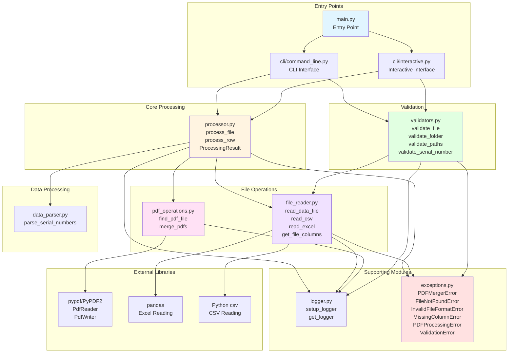
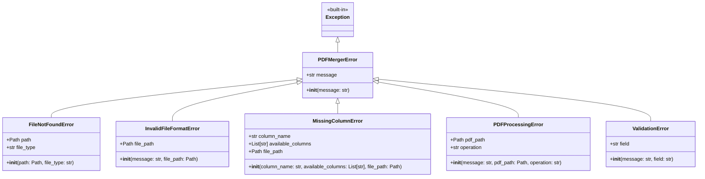
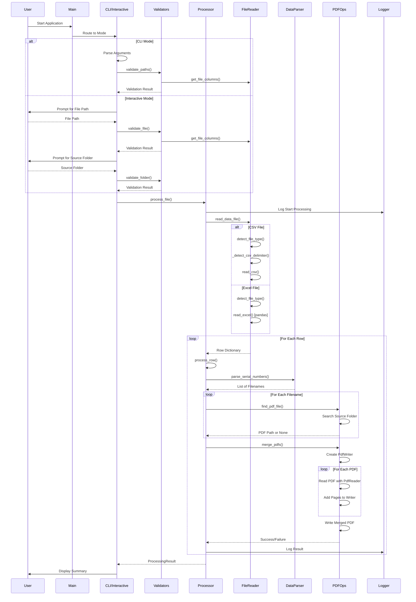
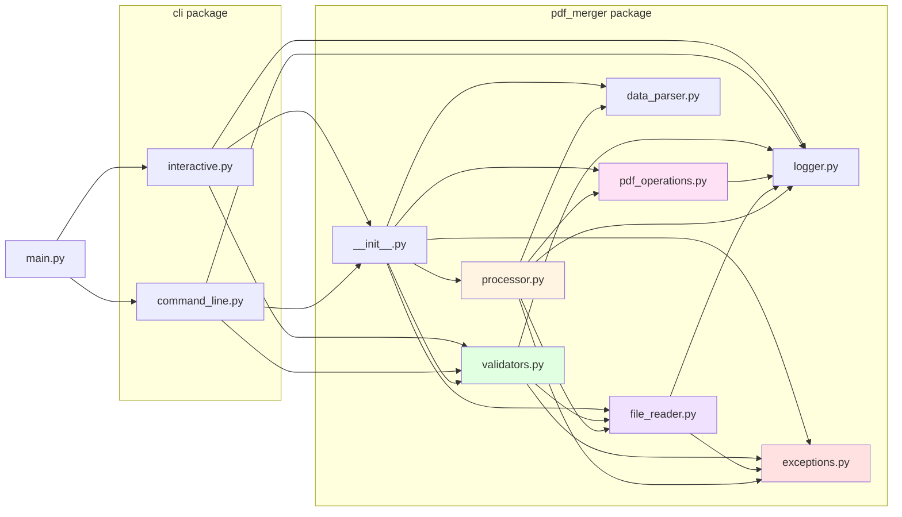

# PDF Merger - Architecture Diagram

This document contains Mermaid diagrams showing the architecture and workflow of the PDF Merger project.

## System Architecture & Data Flow

```mermaid
flowchart TB
    Start([User Starts Application]) --> CheckArgs{Command Line<br/>Arguments?}
    
    CheckArgs -->|Yes| CLI[CLI Mode<br/>command_line.py]
    CheckArgs -->|No| Interactive[Interactive Mode<br/>interactive.py]
    
    CLI --> ParseArgs[Parse Arguments<br/>argparse]
    Interactive --> GetInput[Get User Input<br/>Prompts for paths]
    
    ParseArgs --> ValidateCLI[validate_paths]
    GetInput --> ValidateInteractive[validate_file<br/>validate_folder]
    
    ValidateCLI -->|Invalid| Exit1[Exit with Error]
    ValidateInteractive -->|Invalid| Retry[Prompt Again]
    Retry --> GetInput
    
    ValidateCLI -->|Valid| Process[process_file]
    ValidateInteractive -->|Valid| Process
    
    Process --> CreateOutput[Create Output Folder]
    CreateOutput --> ReadFile[read_data_file]
    
    ReadFile --> DetectType{File Type?}
    DetectType -->|CSV| ReadCSV[read_csv<br/>Detect Delimiter]
    DetectType -->|Excel| ReadExcel[read_excel<br/>pandas]
    
    ReadCSV --> IterateRows[Iterate Rows]
    ReadExcel --> IterateRows
    
    IterateRows --> ProcessRow[process_row]
    
    ProcessRow --> ParseData[parse_serial_numbers<br/>Split comma-separated]
    ParseData --> FindPDFs[For each filename:<br/>find_pdf_file]
    
    FindPDFs --> SearchPDF[Search Source Folder<br/>Case-insensitive match]
    SearchPDF -->|Found| AddToList[Add to PDF List]
    SearchPDF -->|Not Found| LogWarning[Log Warning]
    
    AddToList --> CheckMore{More<br/>Filenames?}
    LogWarning --> CheckMore
    CheckMore -->|Yes| FindPDFs
    CheckMore -->|No| CheckPDFs{Any PDFs<br/>Found?}
    
    CheckPDFs -->|No| SkipRow[Skip Row<br/>Return False]
    CheckPDFs -->|Yes| MergePDFs[merge_pdfs]
    
    MergePDFs --> CreateWriter[Create PdfWriter]
    CreateWriter --> ReadEachPDF[For each PDF:<br/>PdfReader + Add Pages]
    ReadEachPDF --> WriteOutput[Write Merged PDF<br/>merged_row_N.pdf]
    
    WriteOutput --> Success{Success?}
    Success -->|Yes| IncrementSuccess[Increment Success Count]
    Success -->|No| AddFailed[Add to Failed Rows]
    
    IncrementSuccess --> NextRow{More<br/>Rows?}
    AddFailed --> NextRow
    SkipRow --> NextRow
    
    NextRow -->|Yes| IterateRows
    NextRow -->|No| ReturnResult[Return ProcessingResult]
    
    ReturnResult --> DisplaySummary[Display Summary<br/>Total/Success/Failed]
    DisplaySummary --> End([End])
    
    Exit1 --> End
    
    style Start fill:#e1f5ff
    style End fill:#e1f5ff
    style Process fill:#fff4e1
    style MergePDFs fill:#ffe1f5
    style ValidateCLI fill:#e1ffe1
    style ValidateInteractive fill:#e1ffe1
    style ReadFile fill:#f0e1ff
    style FindPDFs fill:#ffe1f0
```

## Component Architecture

## Exception Hierarchy

## Processing Flow Sequence

## Module Dependencies

